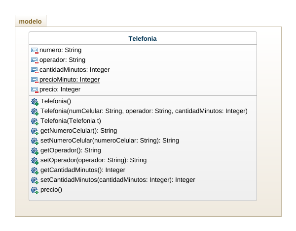

## Ejercicio 
Crear un programa para gestionar un plan de telefonía celular el plan tiene un número de celular, un operador, una cantidad de minutos y un costo por minutos calcular el total a pagar teniendo en cuenta que si el operador es movilujo tiene un 50% de descuento. Usar mínimo tres constructores. 

## Análisis

El plan telefonía necesita de los siguientes datos:
   - Numero de teléfono
   - Operador
   - Cantidad Minutos

Por otro lado, para calcular el precio se creará una variable de tipo estatica donde el precio del minuto sera de 200 pesos, entonces, para calcular el precio se multiplica la cantidad de minutos * precio minuto. 

## Diagrama de Clase

